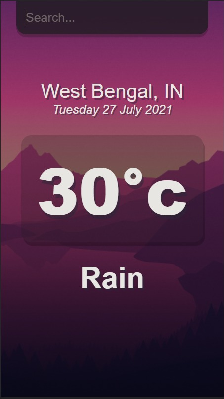

# **Weather App**

## **Introduction**

This is a code repository for **Weather App**.

We have created this project by using React on the frontend and we'll make get requests to Openweathermap API for weather details.

## **Live Deployment** 📦 

Click Here to view the deployment!  
**Note: For better view check this in Mobile**

## **Tech Stack**
 